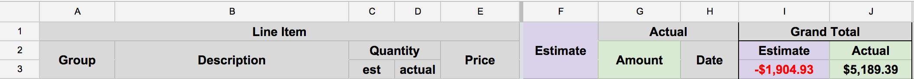

# Run You a Conference For Great Good
- Where's the money come from?
- What should you throw money at?
- Aftercare for Your Conference Organizer

## First things First
### Why do you want to run a conference?
+ help build your community
+ get participation credit outside of "lots of open source commits"

### Mission statement
+ Write up a mission statement
+ Start by figuring out the "elevator pitch" - a 20-30 second explanation of what your conference is about and who it serves
+ From there, work on a more complete write up of ~2 paragraphs
+ Identify and document the ideals and values you'll operate under
  + not a CoC, but what are the bullet point goals you can refer back to whenever you're making a decision - will the thing I'm about to do serve or harm this conference?

## Taking Care of Business
The least fun, for me anyway, is managing the business aspects of running a conference. Anytime you ask people for money in exchange for goods and services, you're gonna have some business concerns. And some liability. Protect yourself, your event, and your community by doing the research and planning ahead.

### LLC
Creating an LLC is surprisingly easy. It's a couple of forms on the internet for the state and federal government. Doing so gave us an entity that:

1. Let us collect money
2. Let us spend money
3. Provide liability protection for ourselves and our families

### Accountants & Taxes
Those are pretty important things for a conference. Also, please don't forget to follow up with a tax accountant in your area. Earmark some money for them early on as they will repeatedly (and patiently, if you're lucky) remind you of all the nit-picky tax stuff that will come up. Depending on your location and plans, you may have to do things like collect and pay sales tax, use tax, amusement tax, income tax, or some combination of taxes. If you're not a tax professional, hire one.

### Bank Accounts
As soon as you have a federal tax ID for the LLC, go open a bank account. Turns out opening a "business checking" account is moderately more involved than a personal checking account. Took me three trips to the bank to finally get it right. Separate accounts for the LLC means no cloudiness in what is conference money and what isn't. If it's a conference expense, it's paid with conference money from the LLC bank accounts and documented in the budget. Setting clear expectations and patterns here provides both an excellent paper trail for your accountant (they will thank you) and should guide any conversation about when/where/on whom conference money is spent.

### Business Licenses
In pursuit of Minimum Viable Conference, I asked our first sponsor (the illustrious Starr Horne @ Honeybadger) what he needed from us to be able to give us a check. His answer was a tax id and mailing address. So I did exactly enough work to make those happen. I got the LLC put together, registered for a federal tax id, and sent Starr an invoice. He promptly paid and his early confidence got us off the ground.

Turns out, while that was enough on Starr's end, there were a few more things for me to do. Most cities and/or states have business licensing requirements and even though we were never interested in turning a profit, the city was still expecting us to _act_ like a business. That means getting a business license from the city, registering with the state Department of Revenue, and probably some other stuff I'm forgetting. I am a terrible businessperson. Find someone knowledgeable, pay them to help you, and heed their advice. Shout out to my boy Patrick at CPM CPA in Seattle!

### Insurance
Every venue I've worked with has included a clause in their contract requiring the LLC to secure "event insurance." This is a liability policy that protects the venue in the case of something going terribly, terribly wrong. To set this up, you'll need twenty minutes, a telephone, and probably something like $100. It's refreshingly inexpensive, wholly mundane, and everyone will feel better when it's in place. I picked our insurance agent because the name of the agency made me laugh (Tripple, Tripple & Tripple). Our two-day, single-track event for 300 people cost us about $90 to meaningfully insure.

## Money is an unfortunate side effect of conference organizing
### Invent a budget.
When you get started, you'll have no ideas how much anything is gonna cost. That's ok. Sit down in front of a spreadsheet and dream up some numbers. A half hour of internet research will get you a basic idea of what banquet halls go for in your area. Ditto catering, renting transportation, hotel blocks, and tshirt printing. Whatever it is you're interested in.

Put each item that either costs of makes money in one column in the spreadsheet. The next column is your best guess--educated or otherwise--on how much you'll spend or make on that thing. The third and fourth columns are blank. They are what the thing actually costs or brings in and on what day that must happen, respectively. Tally the moneies in a another row or column and congratualtions, you've got a working budget. This isn't a line-item ledger of expenditure; it's a high-level accounting of how money is entering and exiting your accounts.

There were more than a few decisions at OS&F last year that hinged on _when_ money was available.
> Yeah, we end up net-positive whether we bought Item X or not, if I buy Item X today, can we pay Vendor Y tomorrow?

Have that budget open in front of you during every organizer meeting. Decisions are driven by the organization mission and the available budget.

## Managing Organizer Expectations
### Decision making
### Discussions around shared values/goals
### Empowering people, especially first-time organizers
### Consensus vs Deadlines

## Choosing Presenters
In our goal of creating a conference that the most number of people will enjoy (and find value in attending) you are in charge of curating the content. Similar to how movie studios have "tent pole releases" that they are reasonably sure will generate a large return, as an organizer a common approach is to find a handful of speakers who are talented and available to give talks, workshops, or other presentations on topics relevant to your conference. If announced early enough, these invited speakers can set not only the tone of the CFP submissions you'll receive and drive interest in potential attendees, but can help maximize your outreach beyond your own personal social networks and communities.

For example, most of the organizers of OSFeels are Rubyists, but by getting a few high-profile Python and Node speakers, we were able to generate a large number of attendees and talk submissions from those communities, by leveraging the connections of those speakers. It also opened a number of sponsors we hadn't previously identified as possible sources of support.

### Inviting Folks
+ it doesn't hurt to ask
+ ask early
+ make them feel special, because they are
+ give them as much info and support as you can
+ stay in contact and keep them informed about progress
  + invited speakers are an asset - keep them happy!
+ once they accept, work with them to identify communities and sponsors for additional outreach
  + they get publicity, too, so they want to help promote their appearance on your stage

### Running a CFP
+ web based
+ blind it as much as you can
+ give as much information about the nuts and bolts as you can
  + expected length
  + expectations you have of speakers
    + submit slides for review?
    + attend a conference event to meet-n-greet
    + will you be video taping? will talks then be freely available? Get a release!
  + what compensation (honorarium? travel? hotel? free ticket at least?) are you offering?
+ offer example questions you want talks to address, or generic topics you'd like submissions on - don't expect speakers to work in a vacuum building custom content for your community
+ have a link to your CoC to remind folks of content expectations

## The Minimum Viable Conference
### Secure A Location
### Secure Some Funding
### Be Able To Collect Money
### Be Able To Spend Money
### Choose Your Format
### Choose Your Presenters
### Protect Your Investment

## Decisions We Could Have Made, But Didn't
If you're making a list of all the things you like about conferences, it is easy to go overboard and end up with a smorgasbord of every last thing your favorite conferences. Whether you're doing a Minimum Viable Conference or you've got a trust-fund from O'Reilly, it is important to think about each feature or event that you add, and ask "how does this serve our goals or mission statement?"

When we did that for OSFeels, a number of items that other conferences frequently feature were on our list, seemingly mandatory to our very idea of what a tech conference is, but ended up on the cutting room floor for solid reasons.

### Wifi
90% of conferences offer wifi, either a dedicated network provided by the venue, or a special access point brought in especially for the event. 90% of those end up being nearly immediately saturated with traffic, from work laptops, tablets, phones, and who knows what other devices that people tote to the conference space. Conference wifi is usually so bad that it's an unfunny joke to complain about it being crappy.

Ultimately we decided to not offer wifi, and to not pass out the venue access credentials unless someone asked us directly. In our post-conference feedback questionnaire, a number of attendees pointed this out as something they wished we would change, but we had good reasons.

#### The venue's wifi wasn't super awesome
It was decent enough for the 10-15 people who needed it, primarily organizers and a few of our speakers, but having 200 people saturating it would make for a miserable experience.

#### It was going to be expensive
We got a couple quotes and spoke with our conference organizer contacts/support group, and realized that while we certainly could pay several thousand dollars to have adequate wifi to serve a couple hundred tech people, what would that amount to per attendee?

> $4000 / 200 attendees = $20 per attendee

Adding in some padding to account for many of our attendees receiving free or half-price tickets, **we would've had to raise ticket prices $30 each to have dedicated wifi**. This simply did not fit with our mission of keeping the cost of attending as low as possible to make the conference accessible to as many as possible.

#### It wasn't facilitating being present
Although not expressly captured in our mission statement, given the often personal and sensitive nature of the talks, that attendees should be as present in the moment as possible. Checking out of a talk and ducking into work Slack or gmail for a few minutes, or seeing what's happening on Reddit are at best a distraction for everyone around you, and at worst a rude or disrespectful act towards the speaker and other attendees.

One response we received to this policy was "But what if I had a work emergency?" If you attend a conference and are in a job that requires you to be on call, we assume you have means to do so, like a mifi or tethered phone.. and besides, its Seattle. Throw a rock in any direction and you'll hit a coffeeshop with free wifi where you can go and not take away from the communities experience.

### After Party
I, Kerri, love to drink. Jeremy, you enjoy a wee tipple from time to time, yes?

Not everyone does. There are lots of reasons why people don't like to drink, or don't like to be around alcohol. Beyond that, most after parties are loud, raucous events - they can be rough on those of us who are hard of hearing or are less outgoing. More and more conferences are choosing to make sure that their after parties are more inclusive, such as having an after party be a board game party, or as Madison Ruby did, got access to a children's museum after its regular hours - FUN!

Primarily we decided to not have an after party for very practical reasons -- we couldn't find a venue on a Friday or Saturday night on Capitol Hill that was affordable, and while we did have a couple leads, it became clear that we didn't have the people power to handle the logistics. We needed to think about

+ hours of access - could we have the space as late as we wanted?
+ accessibility - could a person with a cane, walker, or wheelchair easily get around the space?
+ safety - could we (or our private security guards) monitor who was coming and going effectively?
+ location - is it near the venue, or are there low friction transit options?

We didn't find a suitable location until the week before the conference, and by that point we realized that we didn't have enough time (or energy!) left to pull off a really great event. I wish we had, though - a good event where attendees could socialize and continue to feel part of a temporary community of conference attendees would've really been a big win, and planning a solid after party is already on the list for next time around.

### T-Shirts/Swag
### Conference Hotel
### Feeding Folks
Holy moly, food is expensive! It was going to cost us ~$30 a head, or around $6000 total to provide a catered meal for 200 people for each day! That is an amazingly high expense, especially since we know that:

+ many attendees will go "off site" for lunch with coworkers or friends
+ we'll never dial in all the food restrictions correctly, wasting food and leaving some people potentially unfed
+ some people would be priced out of attending by an $85 ticket instead of a $55 ticket
+ we would've had to provide extra space for tables to eat at, staging, cleanup, and a banquet license
+ it would've been such a complex affair that it would've required the near full-time attention of an organizer

With the price quote in hand, we decided instead to set people loose on the neighborhood, to spend (or not spend) their own money on food that they wanted to eat. If someone brought their own lunch from home, great. On a corporate per diem, great. Deal with it yourself, and lower the cost for everyone (as well as the organizational complexity for us.)

We used our Ada Developer Academy volunteers wisely, designating a dozen of them as Lunch Leaders. Each was given a destination restaurant to go to, so that no single lunch spot got entirely swamped with hungry attendees. Each Lunch Leader wrote the name of the restaurant and its cuisine -- diner food, Indian, pizza, Russian dumplings -- on a sign, and held it aloft in the theatre lobby. When they'd gathered around them a rough group of about what we felt that restaurant could hand, away they'd go! We gave them the advice to NOT try to sit the entire group together, which forced groups of 4-6 to sit together at separate tables, furthering one of our goals of getting different groups of people interacting.

One side effect was that the neighborhood itself became part of the conference, as people got outside the confines of the venue and got to explore Capitol Hill with its funky stores, its issues of tech gentrification against existing "Gayborhood" residents, capturing a lot of the current character of Seattle. It also provided a richer experience for attendees to intermingle and have space to talk about the conference and the talks they'd seen outside of the venue of the conference itself. Such a distance allowed for some really great discussions to occur, judging from the number of groups that said they missed the start of the afternoon sessions because they were lingering over empty plates!

## Structure Ideas
- 3 / 2 / 1 Pattern (from `Self-Talk`)
- Potentially Chronological

## 80s butt rock to consider
- Skid Row
- Poison
- Van Halen
- Warrant
- White Snake
